# 🏖️ Resort Reservation System


A modern full-stack Resort Reservation Management System built using the MERN ecosystem. The platform allows guests to browse cottages, check availability, make reservations, and receive booking confirmations while providing administrators with complete management tools.

---

## 📖 Overview

The Resort Reservation System is designed to simplify resort booking operations by providing an intuitive interface for guests and a powerful administration dashboard for resort staff.

### Key Goals

- Simplify cottage reservations
- Prevent double-bookings
- Improve customer experience
- Automate reservation management
- Provide real-time availability checking

## 🌐 Live Demo

🔗 **[View Live Demo](YOUR_DEPLOYMENT_LINK_HERE)**

*Note: The demo is hosted on [Vercel/Render] and may take a moment to load if the server is inactive.*

---


## ✨ Features

### 👥 User Features

- User Registration
- Secure Login System
- OTP Email Verification
- Browse Available Cottages
- Search & Filter Cottages
- View Cottage Details
- Calendar-Based Reservation
- Reservation History
- Booking Confirmation Emails
- Mobile Responsive Design

### 👨‍💼 Admin Features

- Admin Dashboard
- Cottage Management (CRUD)
- Reservation Management
- User Management
- Calendar Reservation View
- Image Upload Management
- Booking Status Updates

### 🔒 Security Features

- JWT Authentication
- Role-Based Authorization
- Protected Routes
- Email OTP Verification
- Rate Limiting
- Input Validation
- Secure Cookies
- File Upload Validation

---

## 🛠 Tech Stack

### Frontend

| Technology | Purpose |
|------------|----------|
| React.js | Frontend UI |
| Vite | Build Tool |
| React Router | Routing |
| Axios | API Requests |
| React Hot Toast | Notifications |
| React Loading Skeleton | Loading States |
| Tailwind CSS | Styling |

### Backend

| Technology | Purpose |
|------------|----------|
| Node.js | Runtime |
| Express.js | API Server |
| MongoDB | Database |
| Passport.js | Authentication |
| JWT | Authorization |
| Nodemailer | Email Service |
| Multer | File Upload |
| Cookie Parser | Cookie Management |
| CORS | Cross-Origin Requests |

### Database

- MongoDB Atlas

---

## 📸 Screenshots

### User Dashboard
> Home Page
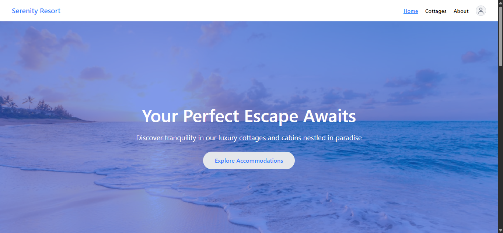
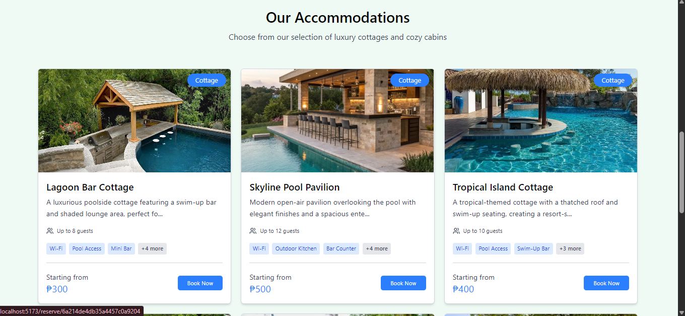
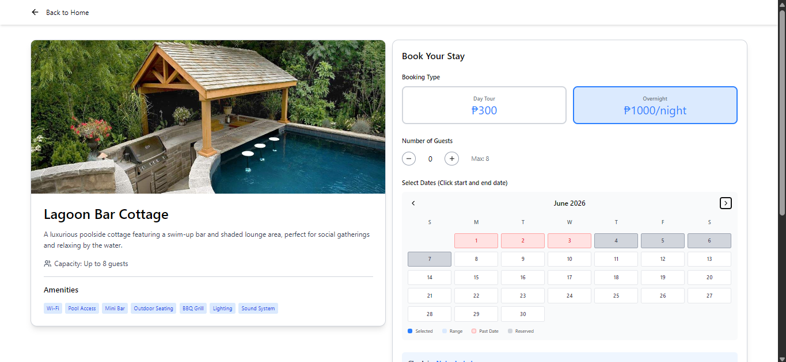
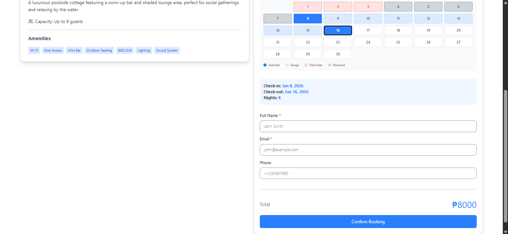
> Accommodation Page
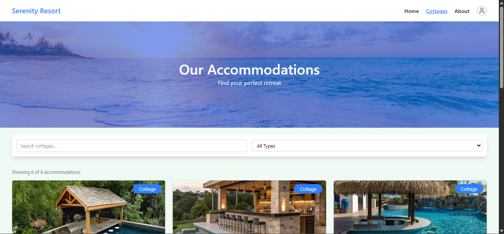
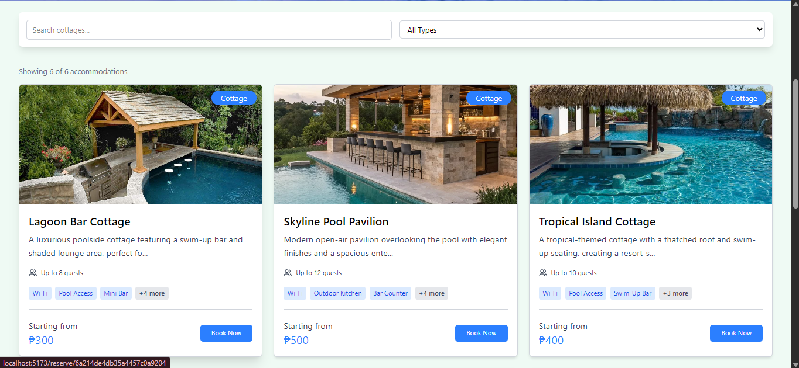
> About Page
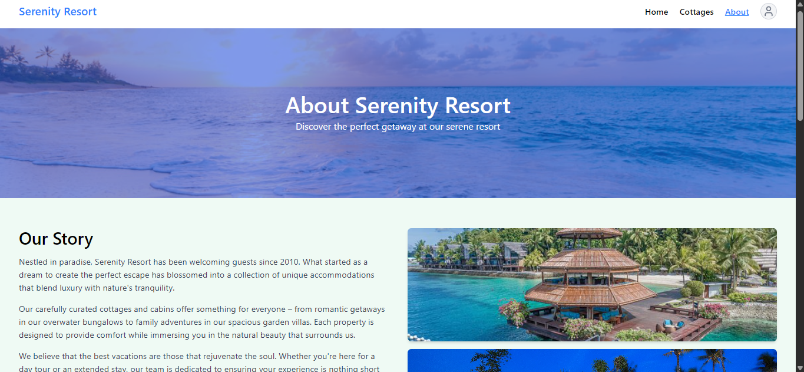
### Admin Dashboard

> Cottages Page
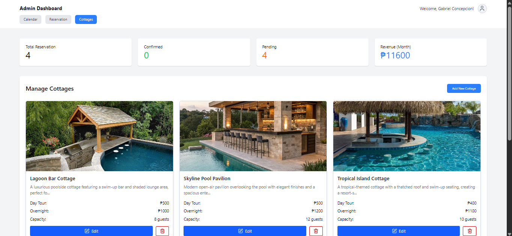
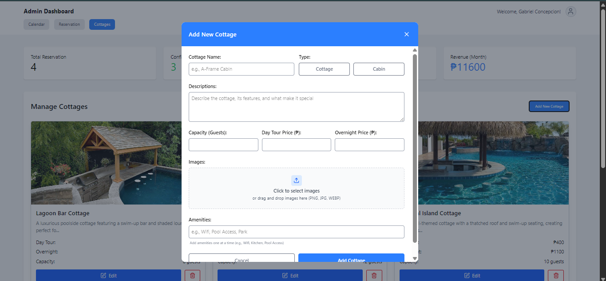
> Reservation Page
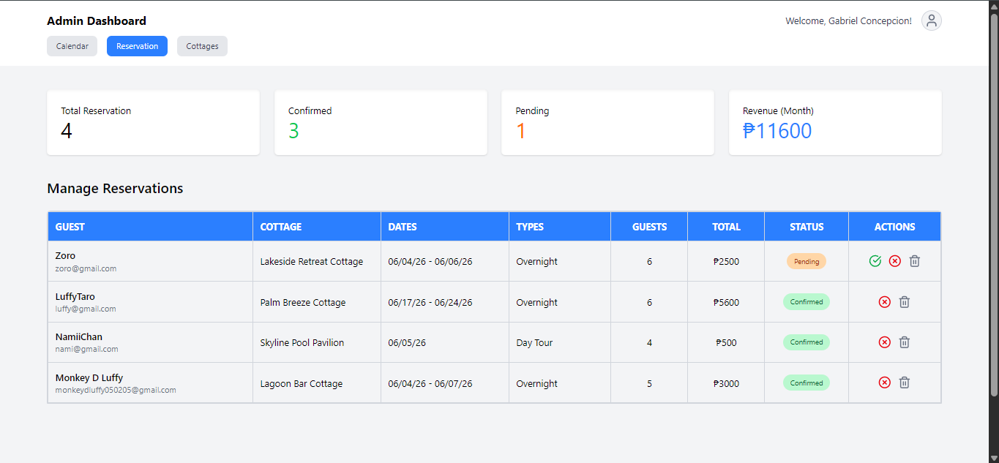
> Calendar Page
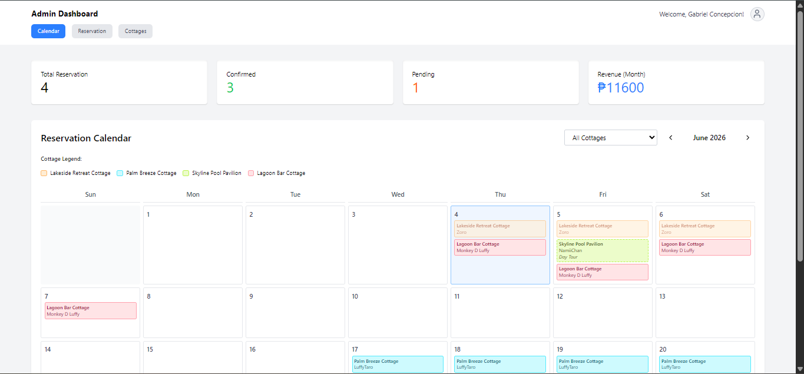
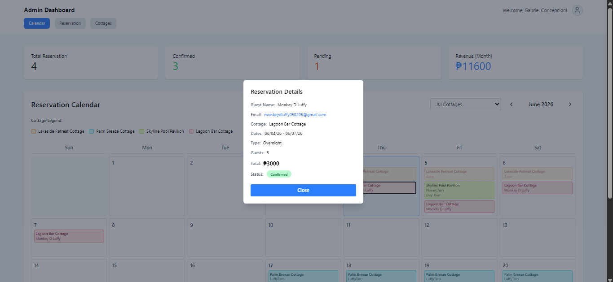
---

## 📂 Project Structure

```bash
Resort_Reservation
│
├── backend
│   ├── config
│   ├── controllers
│   ├── middleware
│   ├── models
│   ├── routes
│   ├── uploads
│   └── server.mjs
│
├── frontend
│   ├── src
│   │   ├── Api
│   │   ├── Components
│   │   ├── Context
│   │   ├── Layout
│   │   ├── Pages
│   │   ├── Service
│   │   ├── Utils
│   │   ├── App.jsx
│   │   └── main.jsx
│
└── README.md
```

---

## 🚀 Installation

### 1. Clone Repository

```bash
git clone https://github.com/Code-W-Gab/Resort_Reservation.git
cd Resort_Reservation
```

### 2. Backend Setup

```bash
cd backend
npm install
```

Create a `.env` file inside the backend folder:

```env
PORT=5000

MONGO_URI=your_mongodb_connection_string

JWT_SECRET=your_jwt_secret

EMAIL_USER=your_email@gmail.com
EMAIL_PASS=your_email_password

CLIENT_URL=http://localhost:5173
```

Start Backend Server:

```bash
npm start
```

---

### 3. Frontend Setup

Open another terminal:

```bash
cd frontend
npm install
```

Create a `.env` file inside the frontend folder:

```env
VITE_API_URL=http://localhost:5000
```

Start Frontend:

```bash
npm run dev
```

---

### 4. Access Application

| Page | URL |
|--------|------|
| User Dashboard | http://localhost:5173/home |
| Login | http://localhost:5173/auth/login |
| Admin Dashboard | http://localhost:5173/calendar |

---

## 🔗 API Documentation

### Authentication Routes

Base URL:

```http
/auth
```

| Method | Endpoint | Description |
|----------|-----------|-------------|
| POST | /register | Register User |
| POST | /login | Login User |
| POST | /verify-otp | Verify OTP |
| POST | /logout | Logout User |
| GET | /profile | Get User Profile |

---

### Cottage Routes

Base URL:

```http
/cottage
```

| Method | Endpoint | Description |
|----------|-----------|-------------|
| GET | / | Get All Cottages |
| GET | /:id | Get Cottage Details |
| POST | / | Create Cottage (Admin) |
| PUT | /:id | Update Cottage (Admin) |
| DELETE | /:id | Delete Cottage (Admin) |

---

### Reservation Routes

Base URL:

```http
/reserve
```

| Method | Endpoint | Description |
|----------|-----------|-------------|
| GET | / | Get Reservations |
| POST | / | Create Reservation |
| PUT | /:id | Update Reservation |
| DELETE | /:id | Cancel Reservation |
| GET | /calendar | Reservation Calendar |

---

## 🔒 Authentication Flow

```text
Register
    │
    ▼
Send OTP Email
    │
    ▼
Verify OTP
    │
    ▼
Login
    │
    ▼
Receive JWT Token
    │
    ▼
Access Protected Routes
```

---

## 🔄 Future Improvements

- Online Payment Integration
- SMS Notifications
- Google OAuth Login
- Resort Reviews & Ratings
- Reservation Analytics Dashboard
- PDF Booking Receipts
- Multi-Resort Management
- Mobile Application


## 📄 License

This project is licensed under the MIT License.

---

## 👨‍💻 Author

### Gabriel S. Concepcion

**GitHub:** https://github.com/Code-W-Gab

**Email:** gabconcepcion02@gmail.com

---

## ⭐ Support

If you found this project useful:

- ⭐ Star the repository
- 🍴 Fork the project
- 🐛 Report issues
- 🚀 Share with others

Thank you for checking out the project!